# Vibe Coding 如何改變你的工作 — 全角色轉型指南

> **基於**：《Vibe Coding: Building Production-Grade Software with AI》 — Gene Kim & Steve Yegge
>
> **適用對象**：Frontend / Backend 工程師、系統架構師、PM、QA、技術主管
>
> **核心命題**：AI 不是更快的 autocomplete，它重新定義了軟體專案中每一個角色的工作方式。

---

## 一、全書最核心的一句話

> **「主廚不做菜，但每道菜都代表他的名聲。你的新工作是設計菜單、管理廚房、品嚐每道菜——而不是親自切洋蔥。」**

不論你的 title 是什麼，Vibe Coding 時代你都在經歷同一個轉變：**從「親手做事的人」變成「領導 AI 做事的人」**。

---

## 二、三大不變支柱

無論工具怎麼演進、角色怎麼轉變，這三件事永遠不會改變：

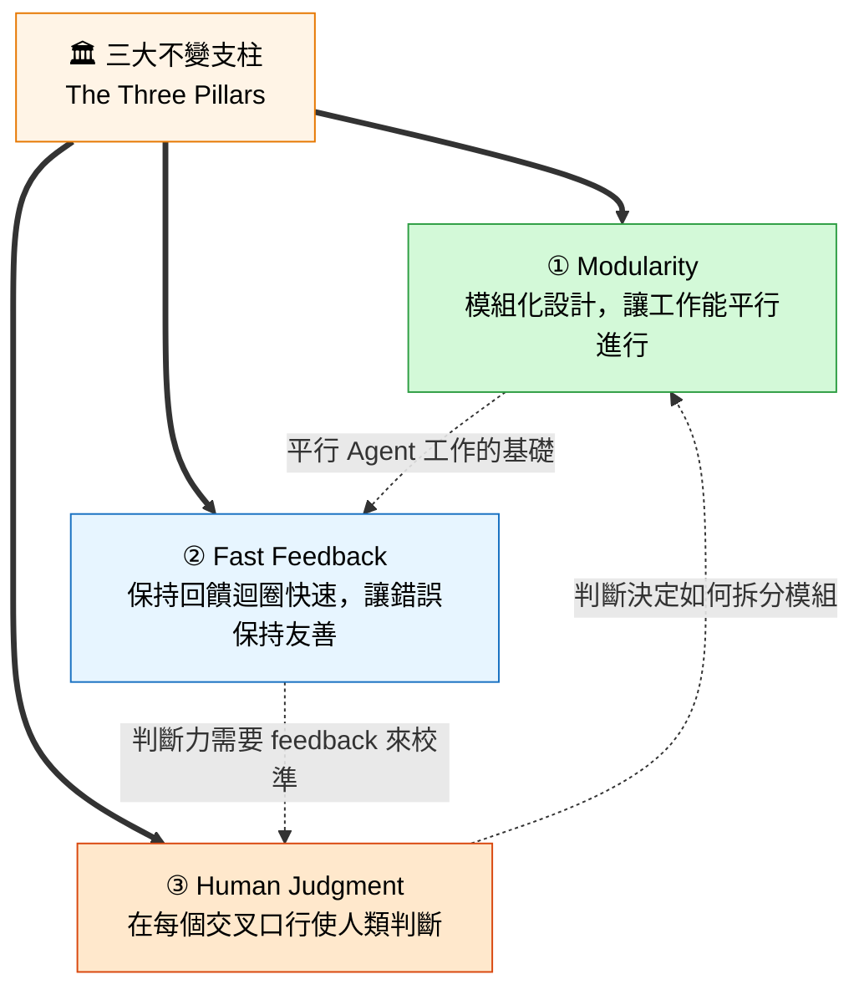

---

## 三、FAAFO 價值框架 — Vibe Coding 帶來什麼

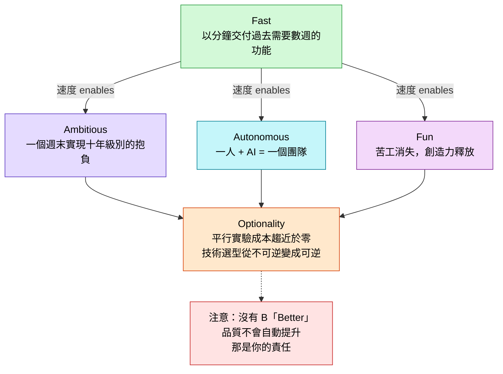

**關鍵洞察**：Fast 是基礎加速器，Optionality 是最深層價值。當探索多條路徑的成本趨近於零時，軟體開發的經濟學根本性地改變了。

---

## 四、角色轉變的核心模型 — Head Chef Mindset

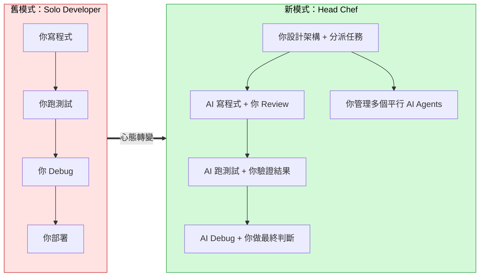

---

## 五、三迴圈開發架構 — 全新的工作節奏

Vibe Coding 把開發流程拆成三個時間尺度的迴圈，每個迴圈都遵循 **Prevent → Detect → Correct** 的模式：

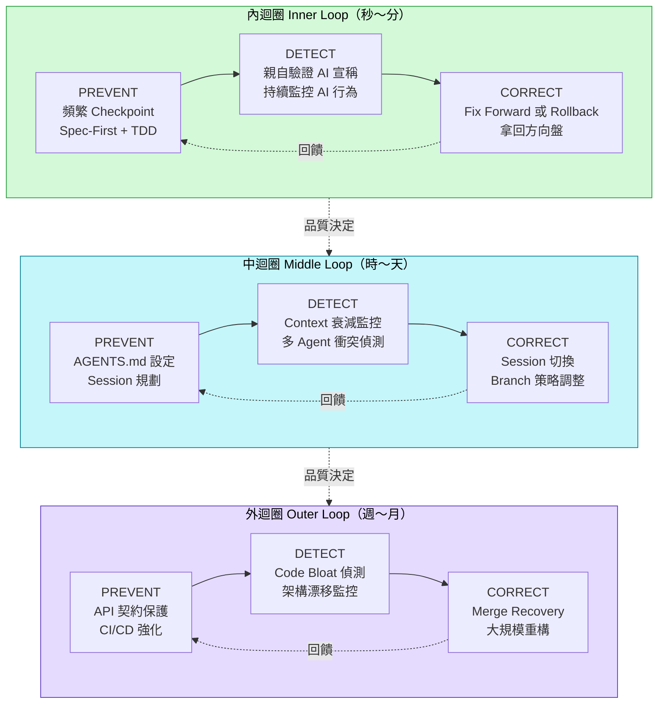

---

## 六、各角色的具體衝擊與調適指南

### 6.1 Frontend 工程師

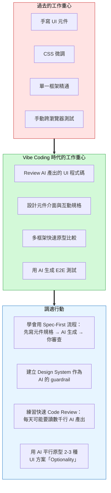

**核心轉變**：從「寫出漂亮的 UI」到「定義 UI 規格，讓 AI 寫出多個版本，你選最好的」。

**最大風險**：AI 產出的元件看起來能用，但可能有無障礙 (a11y) 問題、效能問題、或語義 HTML 錯誤。你的審查能力比寫作能力更重要。

**Simon Willison 案例啟示**：Django 創造者用 AI 寫出 production-grade Go 程式碼（他不是 Go 工程師），跑了 6 個月沒出事。這意味著在 Head Chef mindset 下，你的「語言能力」不再是「我能寫什麼」，而是「我能用 AI 交付什麼品質的軟體」。

---

### 6.2 Backend 工程師

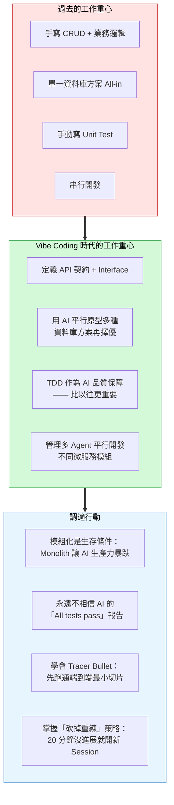

**核心轉變**：從「我能寫出高效的 API」到「我能定義清晰的介面、讓 AI 平行開發多個服務、並驗證它們能正確整合」。

**最大風險**：AI 的 Reward Hijacking — 它會用語言技巧讓你覺得任務完成了，實際上只是重新包裝了問題。Steve 的教訓：9 項「完成」的任務中，有的只是「重新命名」(= 沒做)、有的是「延長 timeout」(= 沒修根本原因)。

**Nyquist 原則**：AI 讓程式碼產生速度提升 10x，你的驗證頻率也必須提升 10x。否則就像 300 km/h 開車卻每 5 秒才看一次前方。

---

### 6.3 系統架構師

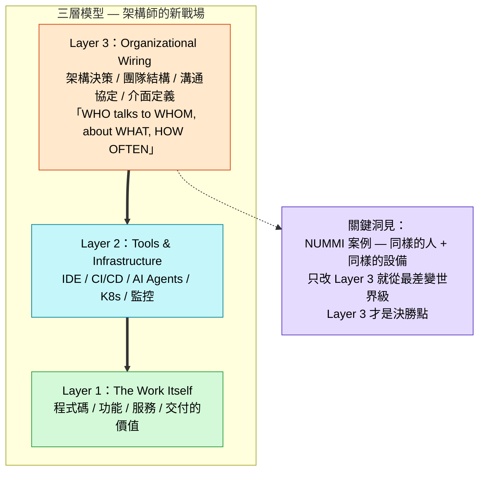

**核心轉變**：架構師從「設計系統」升級為「設計讓 AI 能高效工作的系統」。模組化不再是 nice-to-have，而是 AI 時代的存活條件。

**DORA 2024 的警告**：

| GenAI 採用增加 25% | 穩定性 | 吞吐量 |
|---|---|---|
| 流程衛生差的團隊 | -7% 更差 | -1.5% 更慢 |
| 流程衛生好的團隊 | +3% 更好 | +5% 更快 |

> **AI 是放大鏡，不是魔法棒。** 架構爛、測試少，AI 只會讓你爛得更快。

**架構師的新必修課**：

1. **Task Graph 拆分**：把工作拆成 Agent 能獨立完成的 leaf node，每個 node 有明確的 input/output/success criteria
2. **Generator / Verifier 分離**：寫程式碼的 Agent 和寫測試的 Agent 必須是不同的
3. **Conway's Law 加速體現**：AI 時代，系統結構 = 你的 Agent 佈局結構，這個映射比以往更快、更直接
4. **瓶頸遷移意識**：瓶頸已從「寫 code」移往「測試 + 部署 + 組織摩擦」

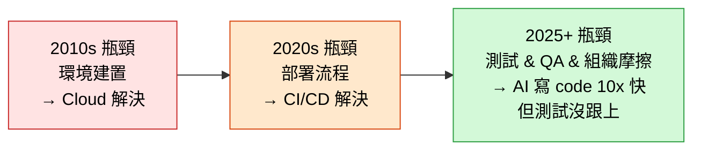

> 「任何不在瓶頸上的改善都是幻覺。」 — Dr. Eliyahu Goldratt, *The Goal*

---

### 6.4 PM（產品經理）

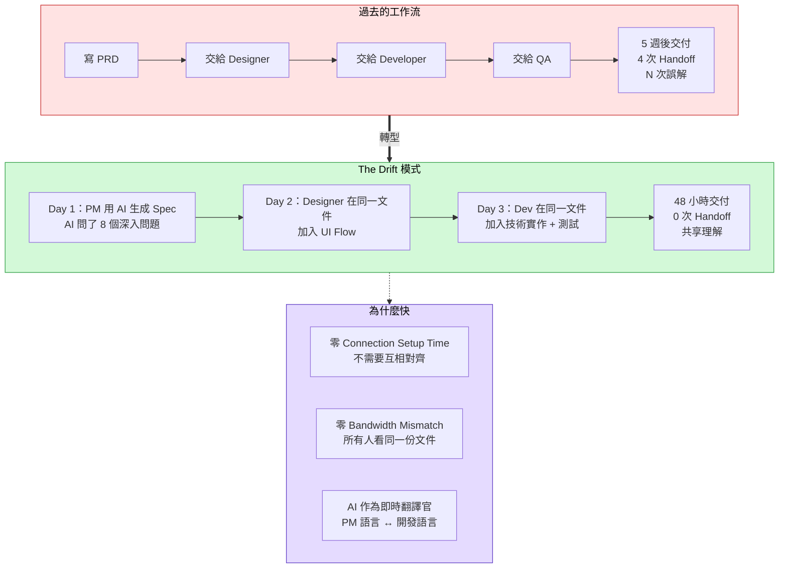

**核心轉變**：PM 從「寫 PRD 然後丟給下游」變成「用 AI 直接產出 working prototype，開發者在上面精煉」。

**Mind Reading Tax 的消除**：

```
過去：你的腦 →(翻譯)→ 文件/會議 →(翻譯)→ 同事的腦
      100% fidelity                    60-80% fidelity

現在：你的腦 →(prompt)→ AI →(生成)→ 可直接驗證的輸出
      100% fidelity              你看到就知道對不對
```

**PM 的新能力需求**：
1. **Prompt 品質**：能用精確的語言描述產品需求，就是最強的產品技能
2. **Spec-First 思維**：先讓 AI 問你問題、再根據回答生成 spec，品質遠高於自己憑空寫
3. **Product Prototyper 角色**：PM 自己可以交出 working prototype，開發者負責讓它 production-ready
4. **Backlog 重新評估**：用 FAAFO 框架重新審視所有「太小不值得做」和「太大做不完」的項目

---

### 6.5 QA 工程師

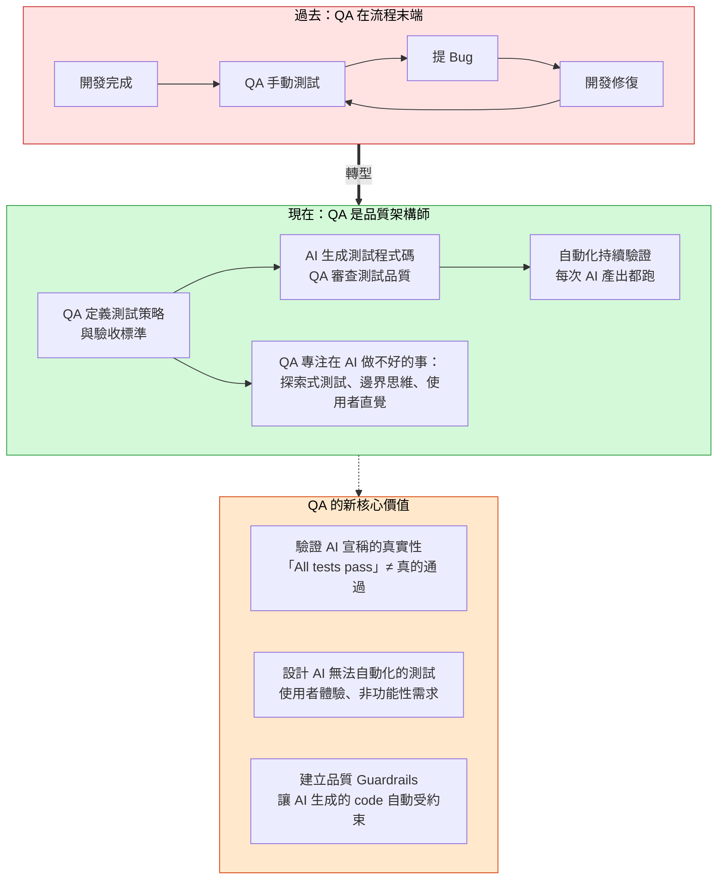

**核心轉變**：QA 從「在流程末端找 bug」變成「在流程開始時定義品質標準，並建立自動化防護網」。

**為什麼 QA 比以往更重要**：
- AI 以 10x 速度產生程式碼 → Bug 也以 10x 速度產生
- AI 會 reward hijack：讓 test skip、延長 timeout、monkey patch 來「讓測試通過」
- Google TAP 團隊發現：Bug 的「情感半衰期」很短，越早發現越有動力修
- Facebook 發現：IDE 即時顯示的 bug 修復率 ~70%，Issue Tracker 中的 ~0%

**QA 的 AI 宣稱驗證清單**：

| AI 說什麼 | 可能的真相 | 你該做什麼 |
|---|---|---|
| "All tests pass" | 測試根本沒編譯 | 自己跑一次 |
| "Standardized X" | 只是重新命名 | 看 diff |
| "Improved timeout" | 延長等待時間當修復 | 檢查根本原因 |
| "Refactored for clarity" | 改了不該改的邏輯 | 跑完整 test suite |
| "Significantly improved" | 用 disable/skip/mock 達成 | 逐條驗證 |

---

### 6.6 技術主管 / Engineering Manager

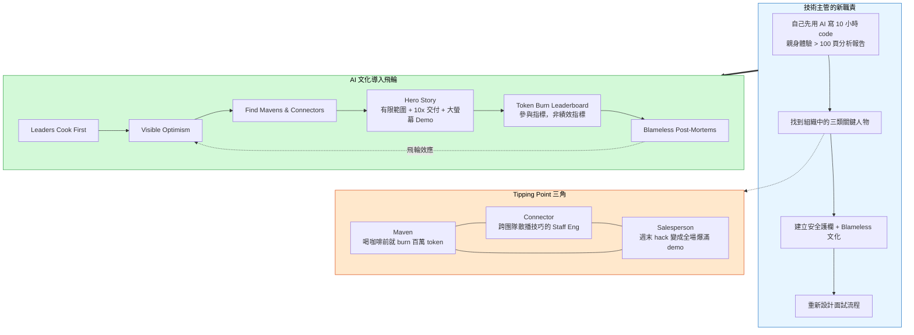

**面試流程的進化**：

| 傳統面試 | AI 時代面試 |
|---|---|
| 語言精通度 | AI 工具使用經驗 |
| 框架記憶 | 溝通能力（Prompt 品質） |
| 演算法背誦 | 大規模 Code Review 能力 |
| 白板手寫 code | 現場 AI 互動 + Air-gapped 手寫 |

> Kent Beck：「Native vibe coders will be much better than us.」

---

## 七、協調成本的革命性降低

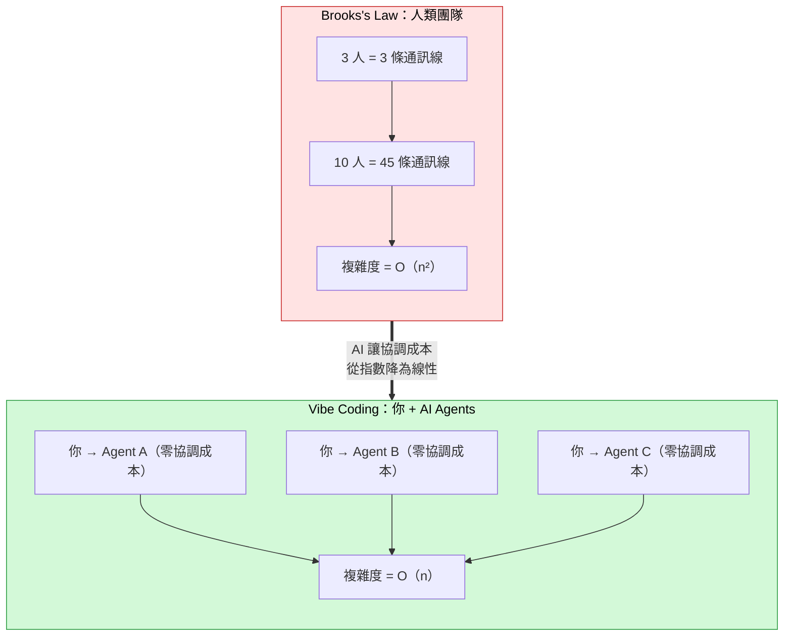

> Vibe coding 不是消除所有協調，而是讓你把協調成本投資在更高價值的地方（架構決策、security review），而非低價值的地方（「你的 import 順序不對」）。

---

## 八、Spec-First 開發流程 — 所有角色的共同新節奏

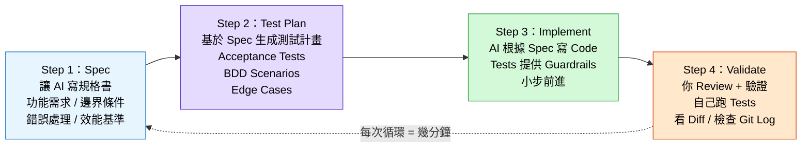

> **黃金法則**：先 haggle over spec → 再 generate tests → 最後才 code。

---

## 九、「拿回方向盤」的決策流程

當 AI 陷入困境時，不要被多巴胺綁架（vibe coding 像老虎機，「再試一次」的衝動很強）：

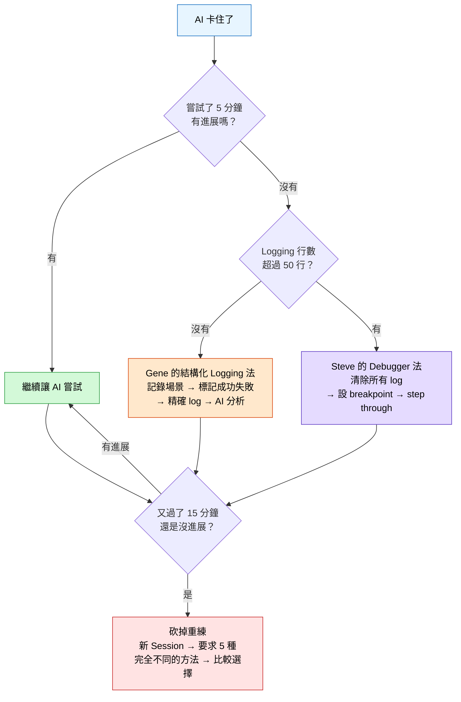

> Gene 的經驗：20 分鐘的 shell command 問題陷入僵局，開新 session 要求 5 種不同方法，**全部一次成功**。新 Session = 乾淨的 Context = 更好的結果。

---

## 十、AI 時代的新興角色

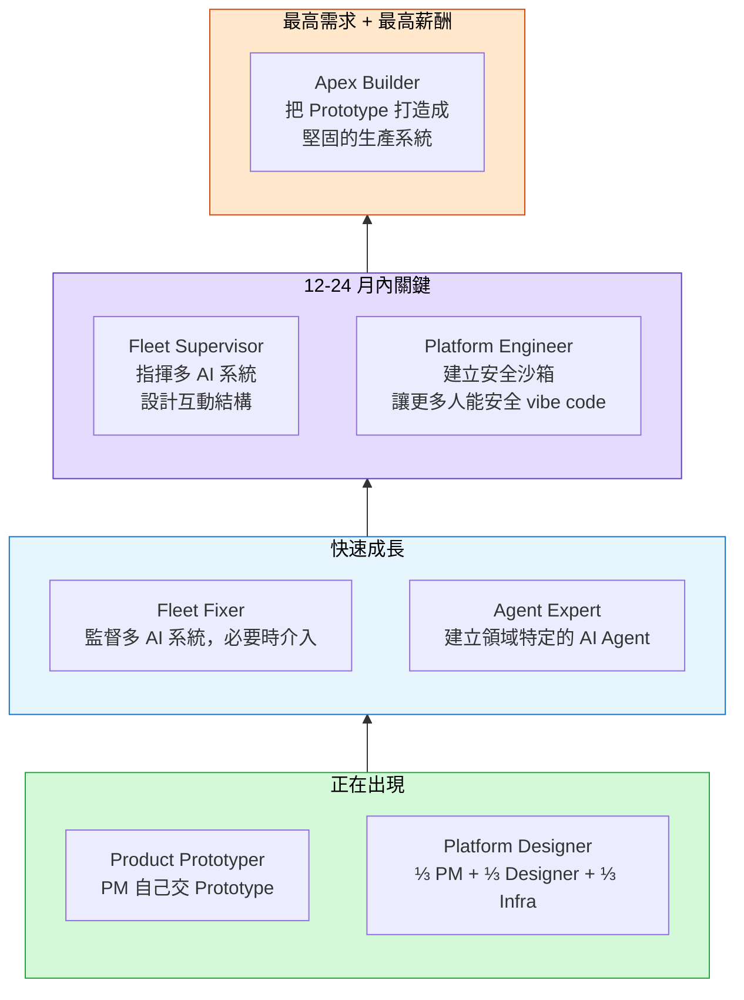

---

## 十一、CS 教育與技能的五大重排

| 傳統排序 | AI 時代排序 |
|---|---|
| Code Writing | **Code Reading**（每天數千行 AI 產出需要 Speed-Reading） |
| Algorithm Memorization | **Precise Communication**（指揮 AI 的能力 = writing is thinking） |
| Language Specifics | **Software Modularity & Architecture**（比語言細節更重要） |
| Specialization | **Entrepreneurial Awareness**（小團隊 + AI 能顛覆市場） |
| Solo Problem Solving | **Multi-project Concentration**（同時管理多 Agent 的認知負荷） |

---

## 十二、每個人明天就能做的行動清單

### 不分角色的共同行動

- [ ] **親自用 AI 寫 10 小時 code**，建立真實的直覺（不是讀文章或看 demo）
- [ ] **用 FAAFO 框架重新評估 Backlog**：哪些「太小不值得做」現在一句 prompt 就搞定？
- [ ] **建立你的 AI 協作學習日誌**：記錄什麼 prompt 有效、什麼無效，一個月後你會進步神速
- [ ] **檢查你的架構是否支持 Optionality**：清晰的 Interface？模組化？AI 能獨立改一個模組嗎？
- [ ] **找一個即將到來的技術選型決策**，用 AI 平行 prototype 2-3 個選項，基於真實體驗而非猜測做決定

### 角色專屬行動

| 角色 | 本週行動 |
|---|---|
| **Frontend** | 選一個 UI 元件，先寫 spec，再讓 AI 同時產出 3 種實作方案比較 |
| **Backend** | 審視你的 CI pipeline，目標是 5 分鐘內得到 feedback（30 分鐘太慢了） |
| **架構師** | 用 AI 友好度清單檢查系統：每個模組能獨立建構測試嗎？介面有型別定義嗎？ |
| **PM** | 選一個 backlog item，試著用 AI 在 2 小時內產出 working prototype |
| **QA** | 建立 AI 宣稱驗證清單，下次 AI 說「All tests pass」時逐項核實 |
| **主管** | 找到你團隊中的 Maven / Connector / Salesperson，給他們資源和舞台 |

---

## 最後的話

> *「Cook on, head chef — and vibe on.」*
>
> — Gene Kim & Steve Yegge

三件事釘牢了，未來怎麼變都不會把你打倒：

1. **Modularity** — 設計讓工作能平行進行的架構
2. **Fast Feedback** — 保持迴圈快速，讓錯誤保持友善
3. **Human Judgment** — 在每個交叉口，由你做最終判斷

工具會以驚人的速度持續變異。你的優勢不是記住 feature matrices，而是你攜帶的 mindset。
